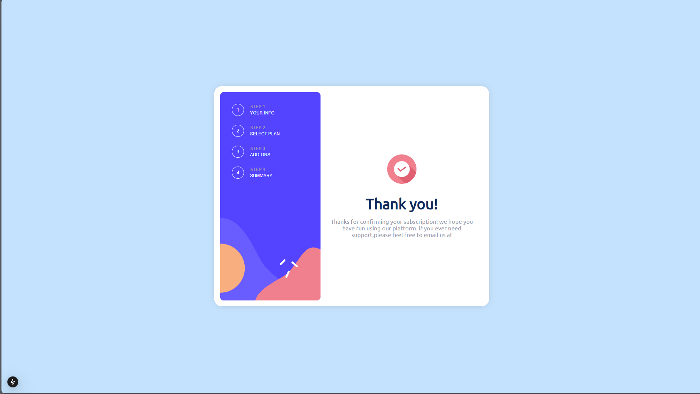

# Frontend Mentor - Multi-step form solution

This is a solution to the [Multi-step form challenge on Frontend Mentor](https://www.frontendmentor.io/challenges/multistep-form-YVAnSdqQBJ). Frontend Mentor challenges help you improve your coding skills by building realistic projects. 

## Table of contents

- [Overview](#overview)
  - [The challenge](#the-challenge)
  - [Screenshot](#screenshot)
  - [Links](#links)
- [My process](#my-process)
  - [Built with](#built-with)
  - [What I learned](#what-i-learned)
  - [Continued development](#continued-development)
- [Author](#author)

## Overview

### The challenge

Users should be able to:

- Complete each step of the sequence
- Go back to a previous step to update their selections
- See a summary of their selections on the final step and confirm their order
- View the optimal layout for the interface depending on their device's screen size
- See hover and focus states for all interactive elements on the page
- Receive form validation messages if:
  - A field has been missed
  - The email address is not formatted correctly
  - A step is submitted, but no selection has been made

### Screenshot

### Links

- Solution URL: [Github repo](https://github.com/DMK980/multi-step-form)
- Live Site URL: [live site ](https://multi-step-form-gamma-six.vercel.app/)

## My process

### Built with

- Semantic HTML5 markup
- CSS custom properties
- Flexbox
- CSS Grid
- Mobile-first workflow
- [React](https://reactjs.org/) - JS library
- [Next.js](https://nextjs.org/) - React framework
- CSS modules 
- Material UI 

### What I learned

I learned alot about form building and how Next.js works. Using useContext for the state management 
was alot better and straightforward other than using Redux for state managment. The logic behind the 
UI really was a challenge but i enjoyed solving the issues that came up

### Continued development

What i need to improve on is responsiveness for large screens and also incorporate animations and transitions to 
really elevate the user experience abit more. Aswell adding a backend service and connecting the frontend to it
would be a great challenge

## Author

- Frontend Mentor - [@DMK980](https://www.frontendmentor.io/profile/DMK980)

